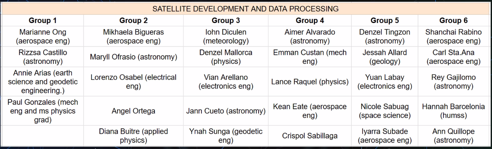

April was a wild ride. So much so that I was unable to attend to my blog and programming projects for a whole month. 

Even my last post was a recap!

---

<h3> Resume Update </h3>

Having completed my first Azure Certification [(AZ-305)](https://www.credly.com/badges/8d8e548f-2f0e-4823-9b43-ab1a389e11ad/public_url), I immediately inserted the badge on my Curriculum Vitae, where I have compiled all credentials I have obtained over the past 2 years. I realized that
even if my skills are geared towards clusters, either in writing, programming and finance; I needed to have a unified CV. Why? Because from there, I can create subsets of resumes that will be tailored to the job, internship, or program that I will apply for. I call it "[CV - Unified](https://docs.google.com/document/d/1pNZNRuumEhgQSM9wsu4Ep5A47F5mVIjAY7YZJnKFl4k/edit?usp=sharing)" and then I would change it's name to "Resume - Company/Program Name"

So far, I have created a Resume for the Shoppee Internship and for the MLH Fellowship. 
I will explain more of these later, but I believe I might not be able to get through.
At least, I demonstrated a successful use of my Unified CV system.

---

<h3> Github Campus Expert Rejection </h3>

Now that I'm recapping about it, I kind of forgot what the application exactly contained.

However, I remember it being only 3 questions, The first one asked me to tell something about myself and the community I represent. The second one asked about the struggles we face as a community, and the final one asked about how being in the program could aid me in growing ym community.

Having been a part of no tech community based in our university, and not in contact with any other community or person from the College of Science and Computer Studies, I knew I would have no chance. The person that I was talking to about forming a Google Developer Student Club in our university has fallen silent. Now I don't have any person who could talk about this. I may have to do something to reach out to someone from the CSIT Programs.

Anyway, I answered as if I was a part of a community that was struggling to grow because the pandemic restrictions in our country was just loosening up. 

You can imagine how a story without basis and honesty can go.

It went short, sounded too dry and shallow, and was obviously a pretentious attempt to pass the process.

Two weeks later, I got the rejection email. They highlighted in the email the key characteristics of the Campus Expert they were looking for. I don't have those. I won't apply for next year. I tried once and I failed. I will recommend the person I am talking to to apply though (He already told me he will.)

Situations like these are moments telling me that I can have everything that I will ask for. But there's nothing wrong with asking in the first place nonetheless. 

Hence, I'll keep asking for more opportunities like these. 

---

<h3> CEATSG Events and Responsibilities for April </h3>

Ah this one. This one was a bit tricky this April. April only has 4 weeks.
The last two was occupied by the Midterms Week and Self-care week, respectively.
The first two was spent on preparations for the Malakasang Labanan: Intramurals 2023.

It was a hard month for me to do my duties as a Junior Officer. I had to stay at home most of the time. Mom doesn't really allow me to got to school these days because she knows how much I will spend on my fare. Thankfully, I now have a reason to counter this current situation of mine which I will explain later.

They had to do props for the CEAT Stallions, they had to arrange papers for the CEAT Rebyuhan and other activities. Basically, most of the things they have done is related to the Intramurals or preparations to the next two CEATSG events: Rebyuhan and Grad Ball.

Myself not appearing in the events that the CEATSG is participating or has hosted makes me a very inactive person in the eyes of the officers, leaving me with no approval from them. In turn, this situation is hard for me as they will turn a side eye to me when I run in the Upcoming Elections. It is going to be hard. My conscience, patience, and willpower will be tested under the pressure of judgement from the officers and my peers.

---

<h3> Non Professional Driver's License </h3>

This is the reason why I am so hard-faced about running for a position in the CEAT Student Government. I was finally able to secure a Driver's License at the Biñan LTO Branch. I had always long heard that the District Office's service was pleasant and many people were able to pass the Practical Exam there. I guess they were right. 

---

<h3> Shoppee Internship Application </h3>

Nothing much about this. I knew I won't get a call or an email from them. Looks like they are looking for 3rd and 4th year students for available employment. They were looking for some technical skills as well. I only know the surface level as compared to the level they were looking for. At least I have shown interest in Cloud Computing.

Nevertheless, I know I won't get in. But there's nothing wrong with trying right?

---

<h3> SEDS Upskill Groups </h3>

Finally! The group was created around 3rd week of April. It has been a silent group, except for some updates about the group made by Dr. Purio. He posted the syllabus, amae us answer a Pre-assessment form, and made us prepare a 1 slide presentation for our self introduction. The Group had a total of approximtely 30 members.

The first meeting was actually finished yesterday night (Written on May 7, 2023). It was somewhat alright. Naturally, the members (most of which are college students, some even Graduate Students) are silent and observing the atmosphere; while Dr. Purio and Chairperson Lovely Andeo were steering the conversation and making the mood. It was lucky that Dr. Purio is a lively person. He never fails to smile and be interested in what each person has to say.

After each person's introduction, the groupings were announced which was made by the Chairperson beforehand. We were grouped according to our skillsets or backgrounds. It was tailored to have diversity in each group. Because of this, I was sorted away from Vian.

Here's the complete set of groupings: 

---

<h3> SPARTA Application </h3>

I was initially hoping that the process fro application wouldn't be a hassle one. We all know how government transactions work. I even looked at Project SPARTA's [website](https://sparta.dap.edu.ph/), and it looks as if a startup company commissioned a bunch of web developers to create a good looking homepage; and then leaving them with no next instructions how to make the website interesting or operating. 

Maybe I was just judging really fast, because the academic year for that program hasn't started yet.
Now it make sense why Project SPARTA's website looks dead. It's because there is no one crrently studying. I mean, that's why they were having a call for application right? 

That might have been too judgemental of me. Oops.

Anyway, their Facebook account [posted](https://web.facebook.com/photo/?fbid=694144759382823&set=a.509820927815208) that the courses will open on the 15th of May. (So 4 days from the time of writing this part of the article.)

Looking forward to learning more about Data Science. For your information, I choose the most rigorous pathway out of 6, which is called the "Data Scientist" pathway. Reason? Why not? You're going to study Data Science anyway. Why get called "Data Steward", when you use the same tools as a Data Scientist does?

Under the curriculum I chose, I had to pick 1 Programming Language elective, and 2 electives for microspecializations.

I chose SQL, instead of Python.

and choose "Domain Knowledge: Finance and Risk" and another one tailored towards Budgeting.

My microspecializations are geared towards Financial Risk Analysis. I like it. 

Why SQL? Again, why not. Python is indeed the most used and popular because of how easy to use it, but it really won't hurt learning a little more outside your comfort zone, right?

Plus the program follows a schedule, curriculum and is organized well. It even follows deadline per course outline in your program's curriculum. What I'm saying is that, since this is structured, It;s better than my usual style of learning called "Study Whatever Pops Into My Mind or Study What's Urgent to be Learned". Plus, it's nearing vacation, so there's time and room for learning.

Hopefully I get accepted, and see a Linang username account on the SPARTA online portal.

---

<h3> University/College Student Government Elections </h3>

I filed my Candidacy at the GMH Building on the Final Day of Filing of Candidacy

---

<h3> Other Matters </h3>

---